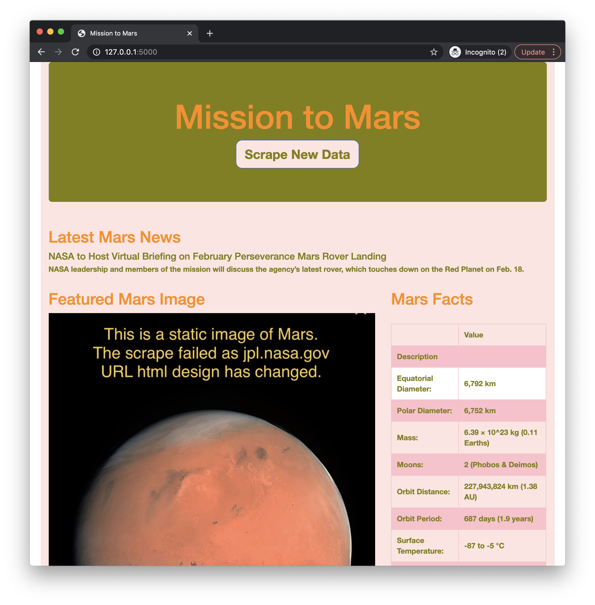
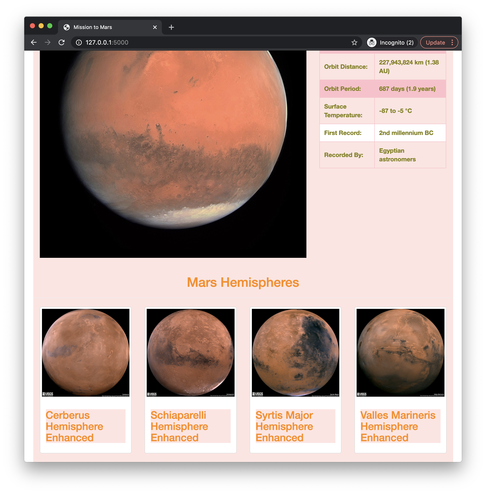
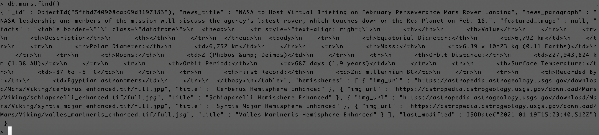

# **Mission-to-Mars**
- The purpose of the project is to web scrape data on the planet Mars using different websites. Web scraping is done using an automated web browser initiated with the help of BeautifulSoup and Splinter packages of Python.
- Using MongoDB database store the unstructured data from the web scrape.
- Create a web application with Flask to display the data from web scrape retrieving the data stored in mongo DB.
- Create HTML page to present the web page with all the scraped information.
- Improve the aesthetics of the web page using bootstrap components and CSS style sheet.
---
## **Hemispheres**
- The data on 4 hemispheres of Mars was scraped using the website - https://astrogeology.usgs.gov/search/results?q=hemisphere+enhanced&k1=target&v1=Mars
- All the 4 images and titles were saved into Mongo DB, and were retrieved from the DB to display on the webpage. 
- HTML was updated appropriately to hold all the scraped information. 
- Using Bootstrap the webpage is made responsive for any of the mobile models say an ipad or iphone 5 / 7s or Pixel.
- The html code was updated so that the 4 hemisphere images are displayed in 1 single line.
- Using css style sheet facts table was customized with padding, alternating row colors, hover color, text color, font style etc.
- Using css style sheet Scrape New Data button was customized with background color, font size, font color, hover color, focus color, border etc.
- Throughout the page the font color and background color was coordinated to beautify the webpage.
- Few screenshots are attached below to get a glimpse of the webpage :
- </img>
- </img>
- The scrape information updated in the mongo DB is as follows :
- </img>
- The jupyter notebook script file can be found at this link : <a href="https://github.com/VinuthaBS/Mission-to-Mars/blob/main/Mission_to_Mars_Challenge.ipynb">------> Mission_to_Mars_Challenge file</a>
- The scraping.py file can be found at this link : <a href="https://github.com/VinuthaBS/Mission-to-Mars/blob/main/scraping.py">------> scraping.py file</a>
- The flask app.py file can be found at this link : <a href="https://github.com/VinuthaBS/Mission-to-Mars/blob/main/app.py">------> FLASK app.py file</a>
- The index.html file can be found at this link : <a href="https://github.com/VinuthaBS/Mission-to-Mars/blob/main/templates/index.html">------> HTML file</a>
- The .css file can be found at this link : <a href="https://github.com/VinuthaBS/Mission-to-Mars/blob/main/static/css/style.css">------> Stylesheet file</a>
---
## **Scrape**
- Mars News with a summary was scraped using the website - https://mars.nasa.gov/news/
- Mars Facts in the form of table was scraped using the website - http://space-facts.com/mars/
- Mars image was scraped using the website - https://www.jpl.nasa.gov/spaceimages/?search=&category=Mars. Unfortunately this website has undergone a lot of change since 11th jan 2021, and the html components have totally changed, hence the original scraping script fails to work now. 
- <strong>Due to this, code was updated such that scraping lines of code is entered only when the "Full Image" element is present. Else image url is updated as None, and the Mission-to-Mars Featured Image section is loaded with the static image provided as default in the html.</strong>

